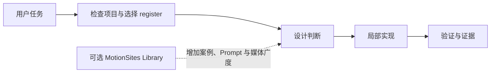
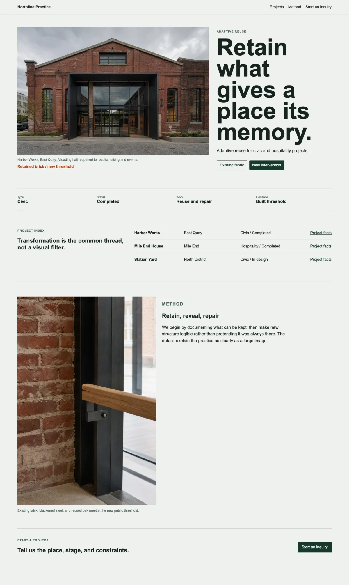
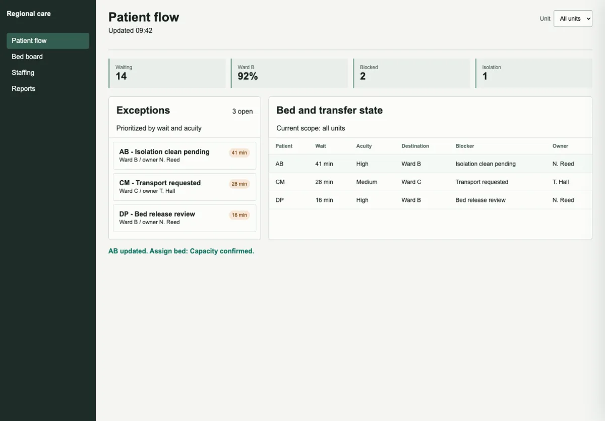
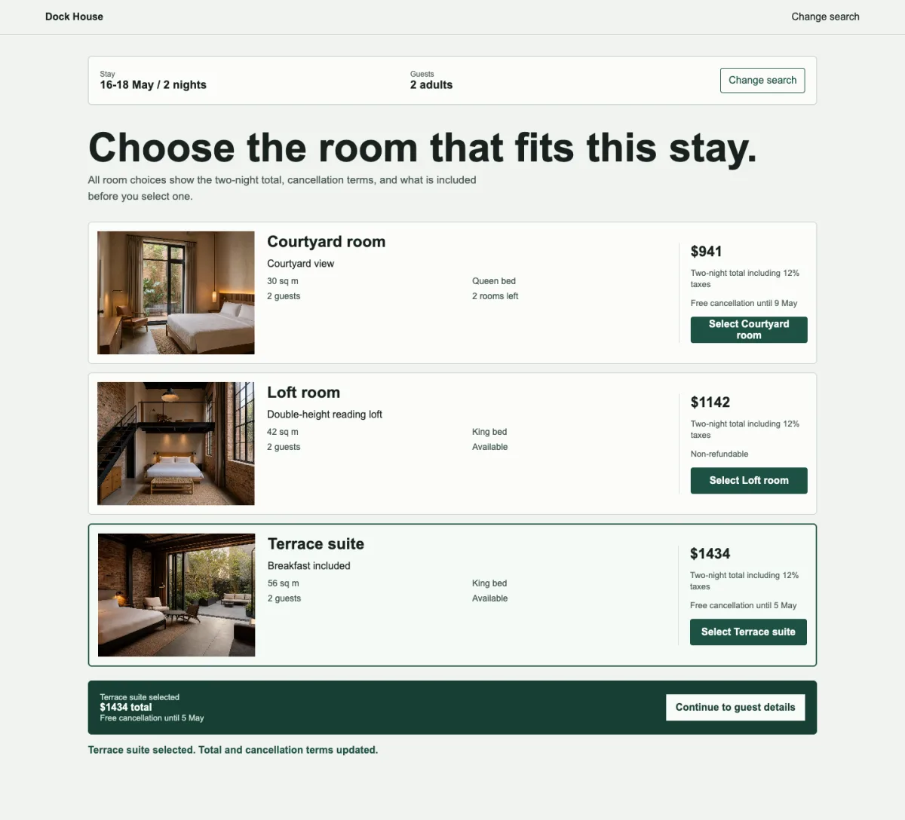

# Immersive Motion UI

面向 Codex 的独立前端设计 Skill：从设计判断、界面实现到验证证据，帮助 AI 构建有辨识度、可用且可维护的 Web UI。

它不是一组固定风格 Prompt，也不是必须连接素材库才能工作的路由壳。Core 自带完整的设计规则、产品 UI 方法、动效策略、案例和验证出口；可选的 MotionSites Library 只负责增加 Prompt、媒体与行业案例的广度。

> 当前范围：Codex-only Core。适用于品牌站、产品后台、数据界面、电商流程、既有页面重设计与 UI 审查。

## 为什么存在

AI 很容易生成“看起来完整、实际同质”的前端：居中的大标题、渐变背景、卡片矩阵、无目的动效，以及缺少真实运行证据的完成声明。

Immersive Motion UI 把问题拆成一条可执行链路：

1. 先读现有项目，保护技术栈、品牌和工作流程。
2. 判断页面的主要任务，而不是先套视觉风格。
3. 明确要避开的通用默认，以及一个真正服务主题的 signature move。
4. 在现有栈内完成克制、可访问、响应式的实现。
5. 用实际命令、浏览器检查或明确的 `NOT EXECUTED` 状态收尾。



## 核心能力

| 能力 | Core 提供什么 |
| --- | --- |
| 设计路由 | 区分 `brand`、`product`、`commerce`、`redesign`、`audit`，避免把所有页面做成落地页 |
| 视觉方向 | 反模板化判断、行业任务族、视觉 persona、设计方向与好坏案例对照 |
| 产品与数据 UI | Dashboard、Admin、表格、图表、状态、单位、来源、置信度和高密度信息架构 |
| Commerce | PDP、PLP、购物车、结账、定价与预订流程中的比较、信任和状态连续性 |
| 动效与媒体 | CSS、GSAP、Framer Motion、3D、视频和媒体选择的适用边界、降级与 reduced-motion |
| 设计系统 | Primitive / semantic token、mode、variant、component state 与跨页面一致性 |
| 重设计与审查 | 保护既有结构的外科式改造，以及带优先级和证据的只读 audit |
| 验证 | 静态扫描、结构化证据、浏览器检查、性能/内存/a11y 专项边界和诚实状态 |

全部 14 个能力模块及其 reference、fallback 和 verifier 定义在 [capability-manifest.json](skills/immersive-motion-ui/capability-manifest.json)。

## 完整页面示例

这些不是孤立的风格图，而是 Core 离线测试中的完整 `after` 页面。截图前执行了各自的主要交互，并同时检查桌面、移动端、控制台、横向溢出、键盘焦点和 reduced-motion。点击图片可查看完整尺寸。

### Brand · Adaptive reuse

场所证据、材料叙事、项目索引和询盘出口共同构成页面，而不是用一张建筑图代替品牌设计。

<p align="center">
  <a href="docs/readme/brand-adaptive-reuse-after.webp">
    
  </a>
</p>

| Product · Patient operations | Commerce · Hotel booking |
| --- | --- |
| <a href="docs/readme/product-operations-after.webp"></a> | <a href="docs/readme/commerce-hotel-booking-after.webp"></a> |
| 稳定导航、异常优先级、状态表格与一次可审计的流转操作。 | 房型比较、真实空间媒体、总价与取消条款、选择状态连续性。 |

## 快速开始

### 1. 安装

适合持续迭代的方式是克隆仓库后创建软连接：

```bash
git clone https://github.com/Conradgui/immersive-motion-ui-skill.git
mkdir -p ~/.codex/skills
ln -s "$(pwd)/immersive-motion-ui-skill/skills/immersive-motion-ui" \
  ~/.codex/skills/immersive-motion-ui
```

如果目标位置已经存在，请先检查它是目录还是软连接，不要直接覆盖。安装后在新的 Codex 任务中使用。

### 2. 调用

显式调用：

```text
$immersive-motion-ui 为这个 SaaS 后台重新设计订单异常处理页，保留现有 React 技术栈。
```

也可以直接描述任务：

```text
审查这个落地页为什么看起来像通用 AI 模板，只给问题和优先级，不要修改文件。

把这个酒店预订页做得更有品牌感，但不要牺牲房型比较和价格条款的可读性。

优化这个数据看板的信息密度、图表选择和空/错/加载状态，并验证移动端布局。
```

### 3. 控制修改方向

Skill 支持一组窄指令，用于调整指定维度而不推翻整个方案：

| 指令 | 行为 |
| --- | --- |
| `audit` | 只读审查，输出 P0/P1/P2，不修改文件 |
| `redesign` | 先说明受保护内容，再做最小必要改造 |
| `bolder` / `quieter` | 提高表达强度或降低视觉噪音 |
| `soul` | 用主题、材料、文案和互动替换通用 AI 默认 |
| `animate` / `depth` | 加强有目的的动效或空间层次，并保留降级 |
| `densify` | 提高产品界面信息密度，不牺牲控制可用性 |

## 它如何工作

Core 在有项目文件时会先检查框架、路由、CSS 系统、组件、响应式结构和已有品牌资产。只有缺失信息会实质改变方案、编辑边界或风险时才追问；用户意见被视为重要意图证据，但不会被盲从。

每个有意义的设计任务都会形成一个简短的 design readout：

- 主要 register 与用户任务
- 现有技术栈或明确假设
- 应避开的通用默认
- 一个 signature design move
- 本轮验证计划

随后只加载与当前任务相关的 reference。入口和完整路由见 [SKILL.md](skills/immersive-motion-ui/SKILL.md)，不会默认把整个知识库塞进上下文。

## Core 与 Library

| 模式 | 能做什么 | 边界 |
| --- | --- | --- |
| Core-only | 完成正常的前端设计判断、实现、重设计、审查和验证 | 默认模式，无外部语料依赖 |
| Core + Library | 在 Core 已确定方向后，查询更多 Prompt、媒体、案例和行业素材 | Library 不能覆盖 Core 的任务判断和安全边界 |
| Library-only | 作为独立 Prompt 与媒体资产库供 Codex 检索 | 不等同于完整设计 Skill |

Core 查询不到 Library 时会继续工作；`query-library.mjs` 返回 `LIBRARY_NOT_FOUND` 不是失败。未来的 Library 仓库是 `Conradgui/immersive-motion-ui-library`，但它不属于本仓库的安装内容。

## References 与示例

本仓库不是空壳。Core 内含 25 个本地 reference，覆盖设计方向、品牌、产品、Commerce、数据可视化、动效、媒体、现代 Web、设计系统、性能、内存、a11y 和验证方法。索引见 [references/README.md](skills/immersive-motion-ui/references/README.md)。

[examples/README.md](skills/immersive-motion-ui/examples/README.md) 提供两类有边界的示例：

- 三组可离线打开的 before / after：产品运营、建筑改造品牌页、酒店预订。
- 五组经授权的 Finesse 设计参考：保留来源与许可证，并明确网络和未捆绑依赖边界。

示例用于提取机制，不是默认模板。不要直接复制其品牌、配色、页面构图或技术栈。

## 本地工具

所有 Core 脚本都使用轻量、确定性的本地路径，不要求安装 Library：

```bash
# 扫描模板化 UI、动效与 reduced-motion 风险
node skills/immersive-motion-ui/scripts/audit-ui.mjs <file-or-directory> --pretty

# 生成结构化验证结果；缺少浏览器证据时明确标记 NOT EXECUTED
node skills/immersive-motion-ui/scripts/verify-ui-evidence.mjs <file-or-directory> --pretty

# 校验 14 模块能力合同
node skills/immersive-motion-ui/scripts/validate-capability-manifest.mjs --pretty

# 可选、只读的 Library 查询
node skills/immersive-motion-ui/scripts/query-library.mjs \
  --query "biotech dashboard" --pretty
```

脚本详细参数见 [scripts/README.md](skills/immersive-motion-ui/scripts/README.md)。

## 验证状态

当前 Core package validator、Skill validator 和静态契约测试均已通过。触发代理评测包含 72 条中英双语任务，由两个隔离 Subagent 盲判；holdout 的 activation F1 为 `1.0000`，role Macro-F1 为 `0.9659`，高风险误触发为 `0/10`。

这些数字证明冻结语料上的代理分类表现，不代表 Codex 平台生产环境中的真实自动触发率。项目也不声称已经完成全量浏览器视觉验收、真实全局安装验证或 Codex 以外的平台支持。

运行最小发布验证：

```bash
node scripts/validate-core-package.mjs --pretty
node skills/immersive-motion-ui/scripts/validate-capability-manifest.mjs --pretty
node tests/trigger-eval/run-tests.mjs
```

<details>
<summary>完整静态测试清单</summary>

```bash
node tests/capability-manifest/run-tests.mjs
node tests/routing-dependencies/run-tests.mjs
node tests/industry-directions/run-tests.mjs
node tests/showcase-casebook/run-tests.mjs
node tests/minimal-showcases/run-tests.mjs
node tests/browser-evidence/run-tests.mjs
node tests/commerce-lifecycle/run-tests.mjs
node tests/specialty-evidence/run-tests.mjs
node tests/data-ui/run-tests.mjs
node tests/trigger-eval/run-tests.mjs
```

</details>

## 仓库边界

```text
skills/immersive-motion-ui/
  SKILL.md                 # Codex 入口与路由
  capability-manifest.json # 机器可读能力合同
  references/              # Core 本地知识
  examples/                # 有边界的示例
  scripts/                 # 零 Library 依赖工具
tests/                     # 契约与代理评测
docs/readme/               # GitHub README 完整页面截图，不进入 Skill 安装载荷
scripts/validate-core-package.mjs
core-release-manifest.json
```

本仓库不包含完整 Prompt 语料、大型媒体库、Gallery、Library 索引、多平台镜像或云服务集成。它们不会被偷偷变成 Core 的硬依赖。

## 来源说明

`skills/immersive-motion-ui/examples/finesse-network/` 中的上游示例保留了独立的来源说明与 MIT 许可证。Core 本身当前未在仓库根目录声明公开发布许可证，因此不要把该子目录许可证解释为整个仓库的许可证。
